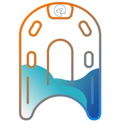
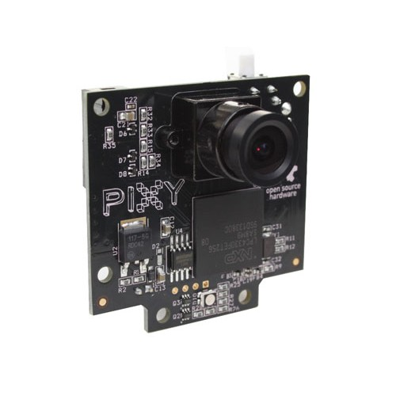
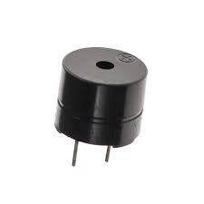

# Guide Pool Dog

     

### Description générale

Notre planche de natation adaptée nommée Guide Pool Dog, est un dispositif conçu spécialement pour les personnes non voyantes ou malvoyantes, leur permettant de pratiquer la natation de manière autonome et sécurisée dans une piscine conventionnelle. Elle est équipée de caméras qui détectent les repères du couloir de nage, tels que la ligne au fond du bassin et les bouées délimitant les bords du couloir. Les informations captées sont alors traitées par un système informatique intégrée à la planche et transmises aux utilisateurs sous la forme de signaux sonores. 

Le système de guidage sonore utilise des tonalités et des combinaisons de sons pour informer les nageurs malvoyants de leur position par rapport aux repères du couloir. Par exemple, lorsque le nageur est à l’approche du mur, un signal sonore sous la forme d’un “bip” long lui transmet cette information ; alors que si le nageur se déporte sur la gauche du couloir, des “bip” bref à répétitions l'informent, et ne cesse que lorsque le nageur a repris sa place. Ainsi, le système de guidage de la planche aide le nageur à maintenir sa trajectoire dans le couloir en évitant les obstacles. 

La planche a été conçue de façon à garder un aspect ergonomique, afin qu’elle puisse correspondre et s’adapter à différents types de corps et compétences des utilisateurs. Sa conception est résistance à l’eau et étanche, ce qui garantit son utilisation sûre et fiable dans un environnement aquatique. 

### Composants électroniques

- MSP432
- Caméra Pixy
- Buzzer

     
     
     

